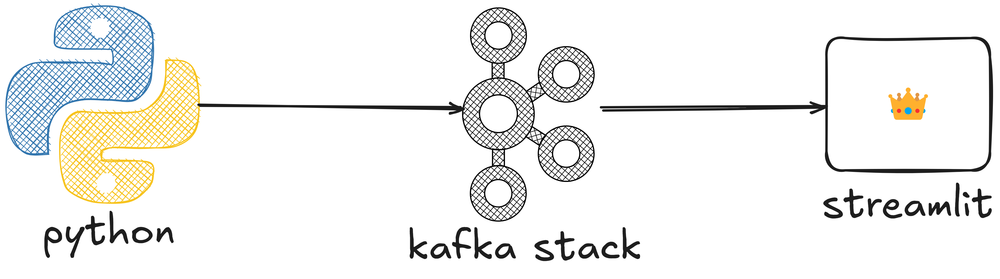
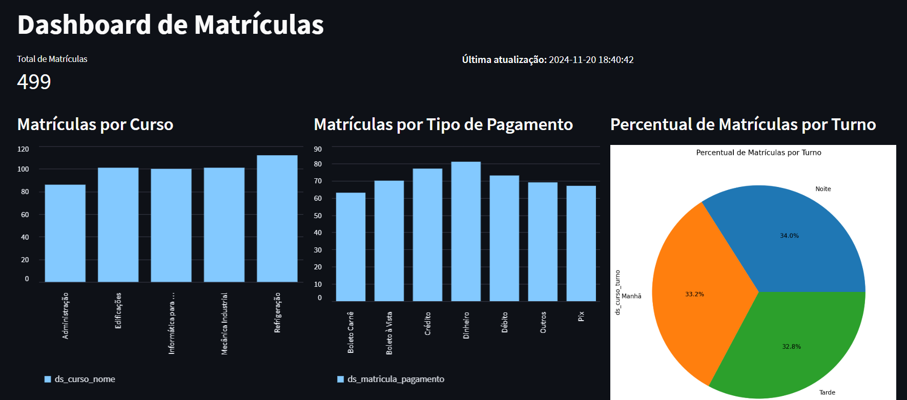
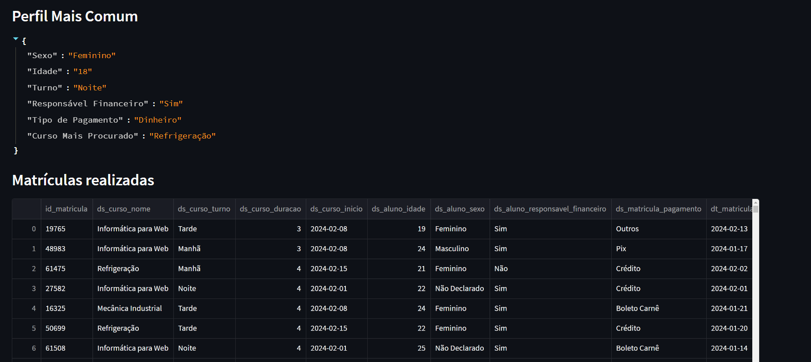

# Projeto Kafka Matrículas

Este projeto utiliza Apache Kafka para gerenciar o fluxo de dados de matrículas entre um **Producer** (que gera os dados) e um aplicativo **Streamlit** (que consome os dados e exibe visualizações interativas). A arquitetura é gerenciada com Docker, utilizando o Kafka, Zookeeper, uma interface de administração Kafka e dois contêineres personalizados para o **Producer** e o **Streamlit**.



---

## Estrutura do Projeto

A estrutura de pastas do projeto é organizada da seguinte forma:

```
.
├── producer/
│   ├── app/                # Código-fonte do Producer
│   │   ├── producer.py     # Código responsável por enviar dados ao Kafka
│   │   └── utils.py        # Funções auxiliares
│   ├── Dockerfile          # Dockerfile do Producer
│   └── requirements.txt    # Dependências do Producer
├── streamlit/
│   ├── app/                # Código-fonte do Streamlit
│   │   ├── dashboard.py    # Interface do Streamlit
│   │   └── utils.py        # Funções auxiliares
│   ├── Dockerfile          # Dockerfile do Streamlit
│   └── requirements.txt    # Dependências do Streamlit
├── docker-compose.yml      # Arquivo de orquestração do Docker
└── README.md               # Documentação do projeto
```

---

## Tecnologias Utilizadas

- **Apache Kafka**: Gerenciamento de mensagens.
- **Zookeeper**: Coordenação do Kafka.
- **Kafka UI**: Interface de administração do Kafka.
- **Python**: Para os scripts do Producer e do Streamlit.
- **Streamlit**: Visualização e análise dos dados.
- **Docker**: Orquestração dos serviços.

---

## Requisitos

- **Docker** e **Docker Compose** instalados na máquina.
- Conexão com a internet para baixar as imagens Docker.

---

## Configuração e Execução

1. **Clone o repositório**:
   ```bash
   git clone https://github.com/jooguilhermesc/kafka-matriculas-tempo-real.git
   cd kafka-matriculas-tempo-real
   ```

2. **Suba os serviços com o Docker Compose**:
   ```bash
   docker-compose up --build
   ```

3. **Acesse o Streamlit**:
   - O aplicativo estará disponível em [http://localhost:8080](http://localhost:8080).

4. **Acesse o Kafka UI**:
   - Acesse [http://localhost:8081](http://localhost:8081) para visualizar os tópicos Kafka.

---

## Objetivo do Projeto

O objetivo do projeto é simular um fluxo de matrículas de cursos para análise e visualização. O Producer gera os dados no seguinte formato:

| Campo                           | Descrição                             |
|---------------------------------|---------------------------------------|
| `id_matricula`                  | Identificador único da matrícula      |
| `ds_curso_nome`                 | Nome do curso                         |
| `ds_curso_turno`                | Turno do curso (manhã/tarde/noite)    |
| `ds_curso_duracao`              | Duração do curso                      |
| `ds_curso_inicio`               | Data de início do curso               |
| `ds_aluno_idade`                | Idade do aluno                        |
| `ds_aluno_sexo`                 | Sexo do aluno                         |
| `ds_aluno_responsavel_financeiro` | Responsável financeiro pelo aluno     |
| `ds_matricula_pagamento`        | Status do pagamento                   |
| `dt_matricula`                  | Data da matrícula                     |

Os dados são enviados ao Kafka e consumidos pelo aplicativo **Streamlit**, que exibe os resultados em um layout interativo, conforme mostrado nas imagens abaixo:




---

## Configuração dos Contêineres

- **Kafka**: Configurado no serviço `kafka` no `docker-compose.yml`.
- **Producer**:
  - Código localizado na pasta `producer/app/`.
  - Configuração do Docker no arquivo `producer/Dockerfile`.
- **Streamlit**:
  - Código localizado na pasta `streamlit/app/`.
  - Configuração do Docker no arquivo `streamlit/Dockerfile`.

---